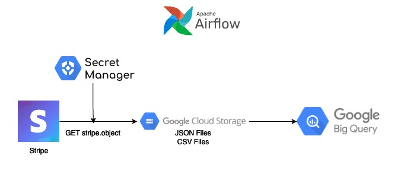
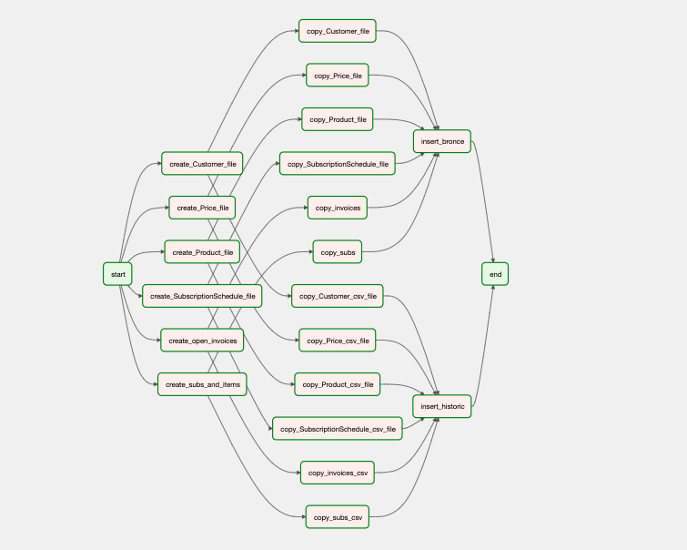

# Fulcrum to stripe pipeline

## Summary

This DAG takes the data from stripes API, saves it on google storage and loads the files into google bigquery.

## Permissions and keys

All the keys required to run the DAG are stored in google secret manager:

- **Stipe API key:**  This process need to read several objects from stripe, for this scenario we use the **STRIPE_READ_ONLY** key.
- **OPSGENIE API Key:** This DAG creates an OPSGENIE alert on failure, the **data_ops_opsgenie** key is required for that.

## Process Diagram

## DAG Graph

## Preparation

**1.** Import stripe api key
**2.** Define environment variables (Buckets, execution date, BigQuery Databases, File and table mapping)

## Read objects from stripe

This process reads the stripe objects and creates the correspondig files in google storage, all files are stored in fulcrum_stripe bucket, the structure to sotre each file in the bucket is: fulcrum_stripe/year/month/day/file, this means we have a folder for each day containging all the files for that specific execution date.

A JSON file and CSV file is created for each object, the first one is created to save the raw data in the bronce tables, the second one is used to keep continuity of the tables populated with the FME pipeline. The JSON file keeps the original structure of the object and the CSV file is a flattened version of the JSON.

This process includes 3 tasks:

**1. create_subs_and_items:** 
Reads the obect Stripe.Subscription to get all subscriptions (all states), and creates the below files in the bucket:

>stripe_subscriptions.json
stripe_subscription_items.json
stripe_subscriptions.csv
stripe_subscription_items.csv

The stripe_subscription_items is an object extracted from stripe subscriptions.

**2. create_open_invoices:** 
Reads the obect Stripe.Invoice to get the 'open' and 'uncollectible' invoices and creates the files:

>stripe_invoices.json
stripe_invoices.csv

**3. create_files:** 
This task is used in a for loop to read data from four different objects:

>stripe.SubscriptionSchedule
stripe.Product
stripe.Price
stripe.Customer

This task reads all states for each object and creates the files below for each one:

>stripe.SubscriptionSchedule
>>stripe_schedules.json
>>stripe_schedules.csv

>stripe.Product
>>stripe_products.json
>>stripe_products.csv

>stripe.Price
>>stripe_prices.json
>>stripe_prices.csv

>stripe.Customer
>>stripe_customers.json
>>stripe_customers.csv

## Write files in Google Big-query

After each task creates the corresponding files, two tasks downstream are triggered, **copy_temp_files** and **copy_gcs_to_gbq_snapshot**.

**1. copy_temp_files:**
Reads the json file and creates a temporary table in **airflow_stripe** schema with the raw data, the table created by each file is named as the file removing "stripe_", the .json extension and adding "_temp" at the end. After the temporary tables are inserted into bronce they are **deleted**.

>subscriptions_temp
>subscription_items_temp
>schedules_temp
>products_temp
>prices_temp
>invoices_temp
>customers_temp

**2. copy_gcs_to_gbq_snapshot:**
Reads the csv file and creates a table in **airflow_sni_stripe** schema with the flatten data, the tables created by this task are:

>subscriptions
>subscription_items
>schedules
>products
>prices
>invoices
>customers

The resulting tables of this process are the snapshots for each object in the last execution date.

## Write JSON files into Bronce

After the process **copy_temp_files** ends, the task **insert_bronce** takes all the temporary tables and inserts the data into the bronce tables in **airflow_stripe**:

>airflow_stripe.subscriptions
>airflow_stripe.subscription_items
>airflow_stripe.schedules
>airflow_stripe.products
>airflow_stripe.prices
>airflow_stripe.invoices
>airflow_stripe.customers

The structure of each table created by this task is:
| id | object | run_date | json_object |
|----|--------|----------|-------------|
| id of the object | type of the object | execution date | JSON raw data |

## Write snapshots into historic tables

After the process **copy_gcs_to_gbq_snapshot** ends the process **insert_historic** starts, this task executes an insert statement into the tables of the same name in the schema **airflow_stripe_history**.
The task **insert_historic** uses the file stripe_schema_fme.json to map the colums and casting needed for each historic table.

>airflow_stripe_history.subscriptions
>airflow_stripe_history.subscription_items
>airflow_stripe_history.schedules
>airflow_stripe_history.products
>airflow_stripe_history.prices
>airflow_stripe_history.customers

## Alert on failure
In tha case of failure in the DAG's execution a P5 priority alert is created in opsgenie indicating the name of the dag that failed and sending a link to the dag in the channel #data-ops-alerts.